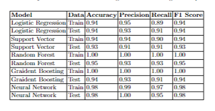

### Project Title: Predictive Analysis for Breast Cancer Using Machine Learning Techniques
#### Author: Bambee M. Garfield
#### Institution: Northwest Missouri State University, Maryville MO 64468, USA
#### Contact: s565741@nwmissouri.edu

### Introduction
- Breast cancer statistics in the US, including incidence rates, survival rates, and impact.
- Importance of awareness and regular screenings for reducing mortality rates.

### Goals of this Research
- Investigate correlation between features like radius, texture, etc., and breast cancer diagnosis.
- Assess effectiveness of machine learning models in diagnosing breast cancer.
- Aim to contribute to personalized medical care in breast cancer.

### Final Report
The final report has been written using LaTex in Overleaf, which can be accessed [here](https://www.overleaf.com/read/mnxndtrqqwyk#7112d5).

### Project Steps

1. Download dataset
- Dataset extracted from [Kaggle.com](https://www.kaggle.com/datasets/uciml/breast-cancer-wisconsin-data), originally from the University of Wisconsin Hospitals, Madison.
- Dataset includes 30 features from fine needle aspirations (FNA) of 569 breast masses.

2. Data Processing
- All code is located in our [GitHub Repo](https://github.com/Bambee26/capstone_project).
- To use the GitHub repo, fork and clone into VS Code.
- Execute a virtual environment:
    - In a new terminal, run:
    ```sh
    python -m venv .venv
- Activate virtual environment, run:
    ```sh
    .venv\Scripts\Activate
- VS Code dependencies are listed in the `requirements.txt` file. To install, run:
  ```sh
  pip install -r requirements.txt
- Clean data - run the cleaning_data file, which will produce an updated_data.csv file for use and a missing_data.csv file for any rows that had missing data

3. Exploratory Data Analysis
- Run all files in the EDA-Jupyter.ipynb file
- EDA process includes indentifying central tendencies, dispersion, and shape of the distribution analyzed. Tables, pie charts, histograms and a heat map were created here to visualize data distribution by diagnosis. ​


4. Machine Learning

- Machine learning code is located in Machine_Learning_Models.ipynb. There are 6 models, each in separate code sections so that each can be run independently. Make sure you have activated the virtual environment as described above and run the requirements text file. 

5. Results
- Final results are compiled in a table at the end of the code in the Jupyter Notebook. 

  

